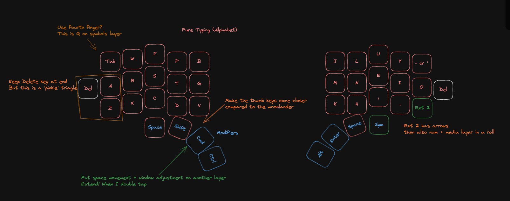

# Crescent keyboard

This keyboard is aimed to be a split ergonomic keyboard with minimal keys and a low profile (for travel and to use with my ipad pad pro).

Inspired by:
- ZSA's moonlander 
- Multi layer layouts + Combos + more adventurous ideas of 'get rid of Q from main layer'
- Foostan's Corne chocolate layout (used as a base in Kicad) - Hotswappable Corne for Chocolate switches using Kailh PCB hot-swap sockets

The Cresent keyboard is a split keyboard with 3x5 column staggered keys
and 4 thumb keys. 

The main idea here is to remove the keys that the pinky has to stretch for (I might bring them back as auxillary keys for layer switching or infrequent operations such as 'tab' and 'esc' which I have found to be really necessary for coding but unsure yet)

I also wanted to remove the keys that my thumb had to stretch for on the moonlander, and yet I do like having at least 4 thumb keys, and feel it is more comfortable to have them curled in, thus I added to the Corne layout.

## Current Progress

I am prototyping on my moonlander with a reduced layout to see how far I can reduce the number of keys and still use this keyboard for both coding, server management and writing fiction.

First layout 

